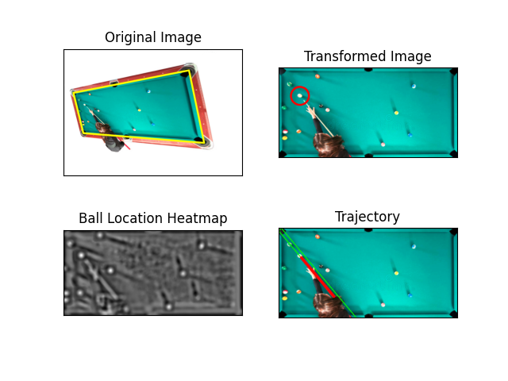
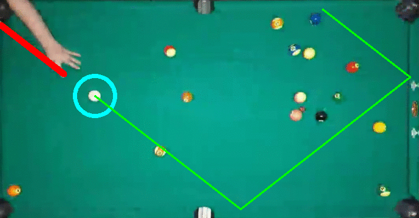

# pool-vision

Independent CV project to process video of a pool table and predict trajectories. Helps you advance from a pool-noob to a pool-master!

## Overview
The code involves no learning methods - the scope of the project was to practice using traditional methods. Calculations are based on contours, edges, Hough transforms, and cross-correlation.

